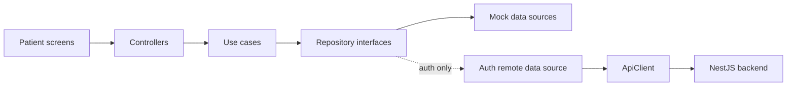

# AsaanCare Frontend Cleanup and Backend Wiring Report

Date: 2026-07-21  
Scope: Flutter frontend, starting with the patient application  
Status: frontend test backup and cleanup complete; backend wiring audit complete

## 1. Plain-language summary

The Flutter app has a usable patient UI and a layered structure, but it is not yet fully connected to the NestJS backend.

- Authentication is the only feature with a remote data source.
- Authentication cannot work against the current backend without contract fixes.
- Doctors, appointment lists, booking UI, prescriptions, pharmacy, wallet, and most patient-home content still use mock or hardcoded data.
- The backend currently implements authentication, current-user lookup, doctor verification metadata, doctor availability, and part of appointment management.
- The safest starting point is to align authentication, then wire patient profile, doctors/availability, and appointments in that order.

Do not enable remote mode for production yet.

## 2. Cleanup and backup record

All confirmed frontend test sources were backed up before deletion.

| Item | Result |
|---|---|
| Backup archive | `../_backups/asaancare-frontend-tests-20260721-130512.zip` |
| Files in archive | 37 |
| Dart test/support files | 35 |
| iOS/macOS Swift test stubs | 2 |
| SHA-256 | `36BCA9472FC8DBC248D1D3DF97A3AF99A759AEA9B367842537CB7BB34F2A52EA` |
| Deleted frontend test tree | `test/` |
| Deleted platform test trees | `ios/RunnerTests/`, `macos/RunnerTests/` |
| Stale Xcode test targets | Removed from both projects and schemes |
| Remaining frontend test files | None found |

The `flutter_test` development dependency remains in `pubspec.yaml`. It is a dependency, not a test file, and retaining it keeps future test restoration simple without manually rewriting `pubspec.lock`.

To restore the archived files from the frontend directory:

```powershell
tar.exe -xf ..\_backups\asaancare-frontend-tests-20260721-130512.zip -C .
```

The Swift files are archived, but their Xcode test targets were also removed for a clean project structure. If platform tests are restored later, recreate those test targets in Xcode or restore the two Xcode project and scheme files from the appropriate Git revision.

## 3. Current application flow



The separation between screens, controllers, use cases, and repositories is useful. The main wiring work is to add typed remote data sources and select them in `lib/core/di/service_locator.dart`.

### Runtime modes

`AppConfig.useMockApi` defaults to `true`, so a normal run stays in mock mode.

Remote mode is selected with Dart defines:

```powershell
flutter run `
  --dart-define=USE_MOCK_API=false `
  --dart-define=API_BASE_URL=http://localhost:3000/api
```

The backend global prefix is `/api/v1`, while frontend endpoint constants begin with `/v1`. Therefore `API_BASE_URL` must currently end in `/api`.

For an Android emulator talking to a backend on the development computer, use `http://10.0.2.2:3000/api`. Local HTTP is permitted only for development; production must use HTTPS.

## 4. Patient route map

| Route | Screen | Current data source | Backend-ready? |
|---|---|---|---|
| `/welcome` | Welcome | Local UI | Yes |
| `/onboarding` | Onboarding | Local UI | Yes |
| `/register` | Registration | Mock or broken remote auth | yes |
| `/login` | Login | Mock or broken remote auth | No |
| `/patient-home` | Patient home | Auth name plus hardcoded cards | No |
| `/profile` | Patient profile/settings | Auth user plus session-only settings | No |
| `/find-doctors` | Doctor search/list | `DoctorMockDataSource` | No |
| `/doctor-detail` | Doctor details and booking entry | Doctor mock plus appointment mock | No |
| `/appointments` | Appointment list | `AppointmentMockDataSource` | No |
| `/medical-records` | Prescriptions/records | `PrescriptionMockDataSource` | No |
| `/pharmacy` | Pharmacy/cart | `PharmacyMockDataSource` | No |
| `/wallet` | Wallet/payment methods | `WalletMockDataSource` | No |

Protected routes check only whether a local `AuthController` session exists. Backend authorization must still be enforced for every protected endpoint.

## 5. Patient feature readiness

### Patient home

Current behavior:

- The greeting reads `AuthController.currentUser.fullName`.
- Featured doctors, fees, ratings, images, and the upcoming appointment are hardcoded in `patient_home_screen.dart`.
- Notifications, voice search, all categories, and health tools show “coming next” messages.
- Quick actions navigate to mock-backed feature screens.

Required wiring:

- Load a patient-home summary endpoint or compose it from profile, doctors, appointments, and notification endpoints.
- Replace doctor slugs such as `doctor_ali` with backend `DoctorProfile.id` UUID values.
- Replace the hardcoded upcoming appointment with the authenticated patient’s next appointment.
- Add explicit loading, empty, retry, and expired-session states.

### Patient profile and settings

Current behavior:

- Name and identity come from the auth user.
- Language and notification settings are memory-only.
- Password reset, privacy, and support are placeholders.

Backend coverage:

- `GET /api/v1/users/me` exists.
- There is no patient profile update endpoint.
- There are no password-reset, notification-preference, active-session, privacy, or support endpoints.

Recommended first contract:

- `GET /api/v1/users/me`
- `PATCH /api/v1/patients/me`
- `PATCH /api/v1/patients/me/preferences`
- `POST /api/v1/auth/forgot-password`
- `POST /api/v1/auth/reset-password`

### Doctors and availability

Current behavior:

- Doctor list/detail data comes from `DoctorMockDataSource`.
- The frontend model includes qualification, rating, review count, experience, fee, patient count, about text, image asset, and verification status.
- Booking dates and time slots are generated or hardcoded locally.

Backend coverage:

- `GET /api/v1/doctors/:id/availability` exists for verified doctors.
- No public doctor list endpoint exists.
- No public doctor detail endpoint exists.
- The current `DoctorProfile` schema does not supply all fields expected by the Flutter `Doctor` entity.

Backend work required before frontend wiring:

- Add `GET /api/v1/doctors` with specialty/search/filter/pagination support.
- Add `GET /api/v1/doctors/:id`.
- Decide which doctor fields are authoritative and extend either the backend schema or frontend model.
- Return bookable slot timestamps, not only recurring availability windows, if the server is responsible for conflict-safe slot calculation.

### Appointments

Current behavior:

- Booking and listing both use `AppointmentMockDataSource` even when remote auth is enabled.
- The frontend sends a caller-supplied `patientId` through its domain interfaces.
- The frontend uses local date/time labels, local fee values, and mock doctor IDs.
- Frontend statuses are only `confirmed`, `completed`, and `cancelled`.

Backend coverage:

- `POST /api/v1/appointments` books for the patient resolved from JWT.
- `GET /api/v1/appointments/:id` returns one owned appointment.
- `PATCH /api/v1/appointments/:id/cancel` supports patient or doctor cancellation.
- Doctor accept/reject endpoints exist.
- No appointment-list endpoint exists.

Important contract mapping:

| Frontend concept | Backend requirement |
|---|---|
| `doctorId` mock slug | `doctorProfileId` UUID |
| Local selected date/time | `slotStart` ISO-8601 UTC timestamp |
| `video`, `audio`, `chat` | `VIDEO`, `AUDIO`, `CHAT` |
| Caller-provided `patientId` | Patient derived from JWT; do not send patient identity |
| Three frontend statuses | Map the complete backend appointment state enum |
| Local `totalFee` | Server-calculated authoritative price |

Add an authenticated `GET /api/v1/appointments?scope=patient&status=...` endpoint before wiring the appointment list. Pagination should be included from the start.

### Medical records and prescriptions

Current behavior:

- Upload, list, and delete operations are implemented only against `PrescriptionMockDataSource`.
- The controller already carries the authenticated patient ID into repository calls.

Backend coverage:

- There is no prescription or medical-record module or database model.

Required backend work:

- Define record ownership and metadata.
- Upload files to private object storage, not the database or application filesystem.
- Use short-lived signed URLs for viewing.
- Validate file type and size on the server and scan uploads.
- Add authenticated list/upload/delete endpoints with audit logging.

### Pharmacy

Current behavior:

- Medicine catalog, recent prescription, cart, and order state are mock-only and session-local.

Backend coverage:

- No pharmacy endpoints or database models exist.

Required backend work:

- Medicine catalog/search/inventory.
- Cart price validation on the server.
- Prescription-required rules.
- Order creation, status history, delivery address, and cancellation.
- Idempotency for order submission.

### Wallet and payments

Current behavior:

- Balance, ledger, payment methods, add-money, charge, and refund operations are mock-only.
- The frontend endpoint constant `/v1/payments/intents` is only a placeholder.

Backend coverage:

- No wallet or payment module exists.

Required backend work:

- Use integer minor units and a server-owned ledger.
- Never trust a balance, fee, charge amount, or refund amount from the client.
- Use payment-provider tokens; never store raw card data in Flutter or this backend.
- Verify signed webhooks and use idempotency keys for every money-moving request.

## 6. Blocking authentication contract mismatches

These issues must be fixed before patient backend wiring begins.

| Concern | Flutter currently does | Backend currently expects/returns | Required decision |
|---|---|---|---|
| API prefix | Calls `/v1/...` | Serves `/api/v1/...` | Keep base URL ending in `/api`, or change endpoint constants consistently |
| Login request | Sends `emailOrPhone` | Requires `email` | Use email-only now or extend backend login DTO safely |
| Patient register | Sends `emailOrPhone`, role `patient` | Requires `email`, role `PATIENT` | Align names and enum casing |
| Login/register user | Requires `fullName` in returned user | Auth service returns the `User` row without profile name | Return a normalized auth user DTO |
| Current user path | Calls `/v1/auth/me` | Exposes `/api/v1/users/me` | Change frontend endpoint or backend route |
| Current user shape | Expects a flat user with `fullName` | Returns nested `patientProfile`/`doctorProfile` | Add an explicit mapper or normalized backend DTO |
| Refresh session | Stores only access token | Issues access and refresh tokens | Store/rotate refresh token securely and retry once on 401 |
| Logout | Sends bearer token with no body | Requires `{ "refreshToken": "..." }` | Send the stored refresh token and clear both tokens |
| Doctor register | Sends multipart files and extra profile fields to `/auth/register` | Accepts JSON DTO; whitelist rejects extra fields; files are not handled | Split account registration from document upload |
| Verification upload | Sends actual files | Backend accepts only `{ "types": [...] }` metadata and stores placeholder keys | Implement real multipart/object-storage upload contract |

A normalized auth response should be shared by register, login, refresh/current-user flows. Example:

```json
{
  "accessToken": "short-lived-jwt",
  "refreshToken": "opaque-rotating-token",
  "expiresIn": "15m",
  "user": {
    "id": "user-uuid",
    "profileId": "patient-profile-uuid",
    "fullName": "Patient Name",
    "email": "patient@example.com",
    "mobile": null,
    "role": "PATIENT"
  }
}
```

Registration may either return this complete session response or return the user and require an explicit login. The frontend and backend must choose one behavior.

## 7. Actual backend endpoint inventory

The following routes exist today under `/api/v1`:

| Method | Route | Access | Frontend use |
|---|---|---|---|
| POST | `/auth/register` | Public, throttled | Called with incompatible patient/doctor contracts |
| POST | `/auth/login` | Public, throttled | Called with incompatible field name |
| POST | `/auth/refresh` | Public, throttled | Not called |
| POST | `/auth/logout` | Public | Called with incompatible body/session design |
| GET | `/users/me` | Authenticated | Not called; frontend calls `/auth/me` |
| POST | `/doctors/verification/documents` | Doctor | Doctor flow calls a different upload design |
| GET | `/doctors/:id/availability` | Public | Not called |
| POST | `/doctors/availability` | Doctor | Not called by patient app |
| POST | `/appointments` | Patient | Not called |
| GET | `/appointments/:id` | Patient/doctor owner | Not called |
| PATCH | `/appointments/:id/cancel` | Patient/doctor owner | Not called |
| PATCH | `/appointments/:id/accept` | Doctor owner | Not called |
| PATCH | `/appointments/:id/reject` | Doctor owner | Not called |
| GET | `/admin/doctors/pending` | Admin/super-admin | Not part of patient app |
| POST | `/admin/doctors/:id/verify` | Admin/super-admin | Not part of patient app |

Declaring a route in `ApiEndpoints` does not mean it exists on the backend or is called by the frontend.

## 8. Recommended implementation order

### Phase 0 — freeze contracts

1. Generate or review the backend OpenAPI document.
2. Agree on one error envelope, one auth user DTO, enum casing, timestamp format, and pagination shape.
3. Decide whether frontend endpoint constants include `/api/v1` or the base URL includes `/api`.
4. Add a request ID to frontend logs and backend responses without logging health data or tokens.

### Phase 1 — patient authentication and session

1. Align login and patient registration fields.
2. Return a normalized user including `fullName`.
3. Change current-user wiring to `/users/me`.
4. Add refresh-token secure storage, rotation, one controlled 401 retry, and correct logout.
5. Add a patient-role guard in the patient route flow, not only a logged-in check.

### Phase 2 — patient profile

1. Add a typed `PatientProfileRemoteDataSource`.
2. Map `users/me` to a patient profile entity.
3. Add update/preferences endpoints and controllers.
4. Keep UI state explicit: initial, loading, loaded, empty, error, unauthorized.

### Phase 3 — doctors and availability

1. Add backend doctor list/detail endpoints.
2. Add frontend doctor JSON models and a remote data source.
3. Replace asset image fields with nullable HTTPS image URLs plus safe fallbacks.
4. Load availability from the server and use backend UUIDs.

### Phase 4 — patient appointments

1. Add backend appointment list endpoint.
2. Add `AppointmentRemoteDataSource` and response models.
3. Remove `patientId` from remote request payloads; derive ownership from JWT.
4. Convert selected slots to ISO UTC and map all statuses.
5. Add cancel and refresh behavior.
6. Let the server calculate availability and fees.

### Phase 5 — records, pharmacy, and wallet

Build these only after their backend models and security boundaries exist. Recommended order: medical records, pharmacy, then payments/wallet.

## 9. Frontend file plan

For each wired feature, keep the current domain boundary and add these pieces:

```text
lib/features/<feature>/
  data/
    datasources/<feature>_remote_data_source.dart
    models/<feature>_model.dart
    repositories/<feature>_repository_impl.dart
  domain/
    entities/
    repositories/
    usecases/
  presentation/
    controllers/
    screens/
```

Update `service_locator.dart` so mock and remote selection happens at the data-source boundary. Do not put `ApiClient` calls directly in widgets or controllers.

Recommended `ApiClient` additions:

- `PUT`, `PATCH`, and `DELETE` JSON methods.
- Array/list response support; the current client accepts only JSON objects.
- A token/session provider instead of passing bearer tokens manually everywhere.
- Refresh coordination so simultaneous 401 responses do not trigger multiple refresh requests.
- Cancellation/disposal where long requests can outlive screens.

## 10. Security and patient-data rules

- The backend must derive the patient from the verified JWT.
- Never log access tokens, refresh tokens, passwords, medical contents, phone numbers, or private file URLs.
- Keep medical documents in private storage with short-lived signed access.
- Validate every uploaded file on the server.
- Enforce appointment and record ownership in backend services, not in Flutter.
- Use HTTPS outside local development.
- Keep access tokens short-lived and refresh tokens rotating/revocable.
- Validate prices, stock, booking slots, and payment state on the server.
- Add audit events for record access, uploads, appointment changes, and money movement.
- Define account deletion, retention, consent, and privacy behavior before production.

## 11. Verification performed

| Check | Result |
|---|---|
| Backup entry count vs source file count | Passed: 37/37 |
| Backup SHA-256 generated | Passed |
| Frontend test-file scan after deletion | Passed: none found |
| iOS project brace balance | Passed: 61/61 |
| macOS project brace balance | Passed: 74/74 |
| iOS/macOS scheme XML parsing | Passed |
| Stale `RunnerTests` Xcode references | None found |
| Direct `dart analyze lib` | No errors or warnings; 3 informational lints |

The three analyzer information messages are existing async-`BuildContext` advisories in `lib/doctor/screens/consultation/write_prescription_screen.dart` at lines 232, 240, and 329. They do not block the patient-app wiring, but should be fixed before release.

The Flutter wrapper baseline command did not complete because the local Flutter SDK had active Dart/Flutter processes and did not emit output before timeout. The two `flutter_tester` processes started by that attempted check were stopped. Direct Dart analysis completed successfully.

Native iOS/macOS compilation cannot be performed on this Windows machine. The generated project structures were checked textually, but an eventual macOS/Xcode build is still required.

## 12. Definition of “patient app wired”

The patient application should be considered wired only when all of the following are true:

- Remote login, registration, refresh, current-user restore, and logout work against the real backend.
- Patient routes reject doctor/admin sessions.
- Doctor list/detail and availability come from the backend.
- Booking, appointment list, appointment detail, and cancellation use backend UUIDs and JWT ownership.
- Patient home shows live doctor and next-appointment data.
- Profile data can be loaded and updated.
- Every remote screen has loading, empty, error, retry, offline, and unauthorized behavior.
- No mock repository is reachable in the production build.
- Sensitive data is not written to logs.
- Integration checks pass against a non-production backend environment.

Until then, keep `USE_MOCK_API=true` for demonstrations and treat remote mode as development-only.
